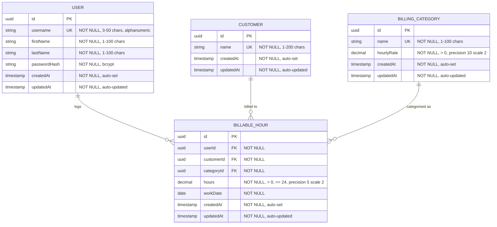

# Data Model: Modernise Monolith Billing Platform

**Phase 1 Output** | **Date**: 2026-02-23 | **Plan**: [plan.md](plan.md)

This document defines the domain entities, their attributes, relationships, validation rules, and state transitions for the modernised billing platform.

---

## Entity Relationship Diagram

---

## Entity Definitions

### User

**Represents**: A person who logs billable hours against customers.

| Attribute | Type | Constraints | Notes |
|-----------|------|-------------|-------|
| id | UUID | PK, auto-generated | Replaces current integer auto-increment |
| username | String | NOT NULL, UNIQUE, 3–50 chars, alphanumeric + underscore | Login identifier |
| firstName | String | NOT NULL, 1–100 chars | Display name |
| lastName | String | NOT NULL, 1–100 chars | Display name |
| passwordHash | String | NOT NULL | BCrypt-hashed, never stored or transmitted in plain text |
| createdAt | Timestamp | NOT NULL, auto-set on creation | ISO 8601 UTC |
| updatedAt | Timestamp | NOT NULL, auto-updated on modification | ISO 8601 UTC |

**Validation Rules**:
- Username must be unique across all users.
- Username must match pattern `^[a-zA-Z0-9_]{3,50}$`.
- First name and last name must not be blank after trimming.
- Password must meet minimum complexity requirements (8+ chars, mixed case, digit).

**Current Defects Being Resolved**:
- No equals/hashCode implementation → add based on `id`.
- No input validation → add Bean Validation annotations.
- Plain text password storage → migrate to BCrypt hashing.

---

### Customer

**Represents**: A client organisation that is billed for work performed.

| Attribute | Type | Constraints | Notes |
|-----------|------|-------------|-------|
| id | UUID | PK, auto-generated | Replaces current integer auto-increment |
| name | String | NOT NULL, UNIQUE, 1–200 chars | Customer display name |
| createdAt | Timestamp | NOT NULL, auto-set on creation | ISO 8601 UTC |
| updatedAt | Timestamp | NOT NULL, auto-updated on modification | ISO 8601 UTC |

**Validation Rules**:
- Name must be unique across all customers.
- Name must not be blank after trimming.
- Name must be sanitised to prevent XSS (HTML-escaped on output).

**Current Defects Being Resolved**:
- Uses Joda-Time `DateTime` for `createdAt` → migrate to `java.time.Instant`.
- Constructor calls `new DateTime()` (Joda) → use `Instant.now()`.

---

### BillingCategory

**Represents**: A type of billable work with an associated hourly rate.

| Attribute | Type | Constraints | Notes |
|-----------|------|-------------|-------|
| id | UUID | PK, auto-generated | Replaces current integer auto-increment |
| name | String | NOT NULL, UNIQUE, 1–100 chars | Category display name |
| hourlyRate | Decimal | NOT NULL, > 0, precision(10,2) | Rate in base currency |
| createdAt | Timestamp | NOT NULL, auto-set on creation | ISO 8601 UTC |
| updatedAt | Timestamp | NOT NULL, auto-updated on modification | ISO 8601 UTC |

**Validation Rules**:
- Hourly rate must be strictly positive (> 0).
- Hourly rate must not exceed a reasonable maximum (e.g., 10,000.00).
- Name must be unique across all categories.

**Current Defects Being Resolved**:
- No rate validation → allows negative or zero rates.
- No upper bound on rate → allows unrealistic values.

---

### BillableHour

**Represents**: A single time entry recording hours worked by a user for a customer under a specific billing category.

| Attribute | Type | Constraints | Notes |
|-----------|------|-------------|-------|
| id | UUID | PK, auto-generated | Replaces current integer auto-increment |
| userId | UUID | FK → User.id, NOT NULL | Who performed the work |
| customerId | UUID | FK → Customer.id, NOT NULL | Who is being billed |
| categoryId | UUID | FK → BillingCategory.id, NOT NULL | Type of work performed |
| hours | Decimal | NOT NULL, > 0, <= 24, precision(5,2) | Hours worked (fractional allowed) |
| workDate | Date | NOT NULL | Date the work was performed (no time component) |
| createdAt | Timestamp | NOT NULL, auto-set on creation | ISO 8601 UTC |
| updatedAt | Timestamp | NOT NULL, auto-updated on modification | ISO 8601 UTC |

**Validation Rules**:
- Hours must be > 0 and <= 24 (cannot log more than 24 hours in a single day).
- Work date must not be in the future.
- Referenced user, customer, and category must exist (enforced by FK constraints).
- A user should not have > 24 total hours across all entries for a single work date (business rule, enforced at service layer).

**Current Defects Being Resolved**:
- Uses Joda-Time for date handling → migrate to `java.time.LocalDate`.
- Stores raw integer FK IDs instead of entity relationships → use JPA `@ManyToOne` associations.
- No validation on hours value → allows negative or unrealistic values.

---

## Bounded Context Ownership

| Entity | Owning Service | Notes |
|--------|---------------|-------|
| User | User Management Service | Full CRUD ownership |
| Customer | Customer Management Service | Full CRUD ownership |
| BillingCategory | Billing & Time Tracking Service | Managed alongside billable hours |
| BillableHour | Billing & Time Tracking Service | Core domain entity, references User and Customer by ID |

**Cross-Context References**:
- BillableHour references User and Customer by ID only (not by entity). The Billing service stores the foreign key UUID but does not own or manage the User or Customer lifecycle.
- The Reporting service reads from all entities (read-only, CQRS pattern) via an optimised read model or event-sourced projections.

---

## Migration Strategy

### Phase 2: Flyway Initial Migration

The first Flyway migration (`V1__initial_schema.sql`) captures the current Derby schema as PostgreSQL-compatible DDL. Subsequent migrations add constraints, indexes, and schema evolution.

### ID Migration

Current integer auto-increment IDs will be migrated to UUIDs:
- New UUID columns added alongside existing integer IDs.
- Foreign key references updated to use UUIDs.
- Integer ID columns dropped after data migration is verified.
- This enables globally unique identifiers required for distributed microservices.

### Date/Time Migration

All Joda-Time fields migrated to `java.time.*`:
- `DateTime` → `Instant` (for timestamps with time zone)
- `LocalDate` (Joda) → `java.time.LocalDate` (for work dates)
- `SimpleDateFormat` → `DateTimeFormatter` (thread-safe, immutable)
