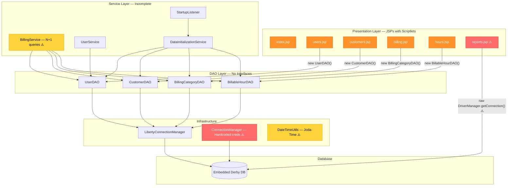
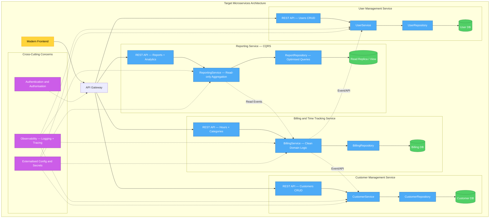

# Feature Specification: Modernise Monolith Billing Platform

**Feature Branch**: `001-modernise-monolith`  
**Created**: 2025-07-17  
**Status**: Draft  
**Input**: User description: "We need to modernise this codebase. We need to identify what needs to be changed, provide rationale as to why while iterating through the code base, we need to review the approach taken and ensure we use mermaid MCP to provide a few of the service breakdown we create."

## Overview

The Big Bad Monolith is a Jakarta EE billing platform that allows users to track billable hours for customers across categories. The application currently suffers from critical security vulnerabilities, zero automated test coverage, tightly coupled architecture, deprecated dependencies, and a presentation layer that bypasses established service boundaries. This specification defines the modernisation journey from a single monolith to a well-structured, secure, testable, and eventually decomposable set of services.

### Current Architecture

The current system is a tightly coupled monolith where JSP pages directly instantiate data access objects, the reporting page bypasses all service layers with raw database connections, and hardcoded credentials are embedded across multiple configuration files.

### Target Architecture

The target state decomposes the monolith into four bounded contexts with clean separation of concerns, proper service interfaces, externalised configuration, and cross-cutting observability.

### Migration Phases

The modernisation follows a phased approach where each phase delivers incremental value and reduces risk before the next phase begins.

## User Scenarios & Testing *(mandatory)*

### User Story 1 — Establish a Safety Net of Automated Tests (Priority: P1)

As a development team, we need automated test coverage for all existing functionality so that we can refactor and modernise the codebase with confidence that we are not breaking existing behaviour.

**Why this priority**: Without tests, every subsequent change carries unquantifiable risk. The application currently has zero automated tests. This is the foundation that enables all other modernisation work. No refactoring should begin until characterisation tests capture the current behaviour of every DAO method, service method, and critical JSP flow.

**Independent Test**: Can be validated by running the full test suite and confirming that all existing functionality is covered by at least one passing test, and that code coverage meets the minimum threshold.

**Acceptance Scenarios**:

1. **Given** the existing codebase with zero tests, **When** a developer runs the test suite, **Then** all DAO methods (UserDAO, CustomerDAO, BillingCategoryDAO, BillableHourDAO) are exercised by at least one characterisation test capturing current behaviour.
2. **Given** the test suite is in place, **When** a developer introduces a behaviour-breaking change, **Then** at least one test fails, alerting the developer before the change reaches production.
3. **Given** the test infrastructure, **When** a developer checks code coverage, **Then** overall line coverage is at least 80% and critical-path coverage (billing calculations, user authentication) is at least 95%.

---

### User Story 2 — Eliminate Critical Security Vulnerabilities (Priority: P1)

As a platform operator, I need all critical security vulnerabilities eliminated so that user data is protected and the platform meets basic security standards.

**Why this priority**: The application contains stored XSS vulnerabilities in all 6 JSP pages (unescaped user input), CSRF vulnerabilities on destructive actions (e.g., customer deletion via GET requests), and hardcoded database credentials in at least 3 locations (ConnectionManager, server.xml, reports.jsp). These represent immediate risk to any user of the system.

**Independent Test**: Can be validated by attempting known XSS payloads, CSRF attacks, and credential exposure checks against the secured application.

**Acceptance Scenarios**:

1. **Given** a customer name containing a script tag is stored, **When** the customers page renders, **Then** the script tag is escaped/sanitised and does not execute.
2. **Given** a user submits a destructive action (delete, update), **When** the request lacks a valid CSRF token, **Then** the system rejects the request with an appropriate error.
3. **Given** the application configuration, **When** an auditor reviews the codebase, **Then** no database credentials, API keys, or secrets are found hardcoded in source files or configuration checked into version control.
4. **Given** a user encounters an application error, **When** the error page renders, **Then** no stack traces, internal paths, or server details are exposed to the user.

---

### User Story 3 — Separate Business Logic from Presentation (Priority: P2)

As a developer, I need business logic cleanly separated from the presentation layer so that each layer can be tested, maintained, and evolved independently.

**Why this priority**: Currently, JSP pages directly instantiate DAO objects (new UserDAO(), new CustomerDAO()), and the reports page (reports.jsp) bypasses the entire service and DAO layers with raw JDBC connections and 300+ lines of embedded business logic. This makes the code untestable and any change extremely risky.

**Independent Test**: Can be validated by confirming that no presentation-layer file contains direct data access code, and that all business logic is accessible through service interfaces.

**Acceptance Scenarios**:

1. **Given** the refactored codebase, **When** a developer examines any presentation-layer file, **Then** no direct data access object instantiation or raw database connection code is found.
2. **Given** the reporting functionality, **When** a developer examines the reporting code, **Then** all reporting logic is encapsulated behind a dedicated service interface, not embedded in the presentation layer.
3. **Given** clean service interfaces exist, **When** a developer writes a unit test for any service, **Then** the test can run without any web server, database, or external dependency.
4. **Given** the refactored architecture, **When** all services are accessed through interfaces, **Then** dependency injection is used throughout — no service or DAO is instantiated with new in business code.

---

### User Story 4 — Modernise Date/Time Handling and Language Level (Priority: P3)

As a developer, I need deprecated libraries replaced with modern equivalents and the language level updated so that the codebase benefits from current security patches, performance improvements, and community support.

**Why this priority**: The application uses Joda-Time (a deprecated library) across entities (Customer, BillableHour), services (DataInitializationService), and utilities (DateTimeUtils). The DateTimeUtils class uses a static mutable SimpleDateFormat which is thread-unsafe. The application runs on an outdated language version that no longer receives security updates.

**Independent Test**: Can be validated by searching the codebase for deprecated library imports and confirming none remain, and by running the application on the target language version.

**Acceptance Scenarios**:

1. **Given** the modernised codebase, **When** a developer searches for deprecated date/time library imports, **Then** zero occurrences are found — all date/time operations use the standard library's modern date/time classes.
2. **Given** the modernised codebase, **When** the application is compiled, **Then** it compiles and runs on the target language version (17+) without errors.
3. **Given** the date/time utility, **When** multiple threads call date formatting simultaneously, **Then** no thread-safety issues occur (the thread-unsafe static mutable formatter is eliminated).

---

### User Story 5 — Improve Data Access Performance (Priority: P3)

As a user of the billing platform, I need the system to perform efficiently when handling large volumes of data so that page load times remain acceptable as usage grows.

**Why this priority**: BillingService contains N+1 query patterns (iterating over collections and executing a query per item). BillableHourDAO loads all hours into memory without pagination. There is no connection pooling despite the dependency being available but unused. These will cause severe performance degradation as data volume grows.

**Independent Test**: Can be validated by loading a representative dataset and measuring query counts and response times.

**Acceptance Scenarios**:

1. **Given** a dataset of 1,000 billable hours across 50 customers, **When** the billing summary is generated, **Then** the number of database queries is proportional to the number of distinct entity types (not the number of rows) — no N+1 patterns remain.
2. **Given** a large dataset, **When** a user requests a list of hours, customers, or categories, **Then** the results are paginated with configurable page size, not loaded entirely into memory.
3. **Given** the application under load, **When** multiple concurrent users access the system, **Then** database connections are pooled and reused rather than created and destroyed per request.

---

### User Story 6 — Decompose into Independent Services (Priority: P4)

As an operations team, we need the monolith decomposed into independently deployable services so that each domain can be scaled, deployed, and maintained independently.

**Why this priority**: This is the final phase and depends on all prior phases being complete. The monolith should be decomposed along the four identified bounded contexts: User Management, Customer Management, Billing & Time Tracking, and Reporting.

**Independent Test**: Can be validated by deploying each service independently and confirming inter-service communication works correctly.

**Acceptance Scenarios**:

1. **Given** the decomposed system, **When** the User Management service is deployed independently, **Then** it serves user CRUD operations through its own API without depending on other services being co-located.
2. **Given** the decomposed system, **When** the Billing & Time Tracking service needs user or customer data, **Then** it obtains it through well-defined inter-service communication (events or API calls), not direct database access.
3. **Given** the Reporting service, **When** a report is generated, **Then** it reads from an optimised read model without impacting the write performance of operational services.
4. **Given** any single service is restarted or updated, **When** other services are running, **Then** they continue to function (possibly with degraded reporting) — no cascading failures occur.

---

### Edge Cases

- What happens when a database migration fails midway — is there a rollback strategy?
- How does the system handle concurrent modifications to the same customer or billing record during the transition from monolith to services?
- What happens to in-flight requests during a service deployment?
- How are existing user sessions handled when the authentication mechanism changes?
- What happens when the reporting service cannot reach the billing service — does it serve stale data or fail gracefully?
- How does the system handle the transition period where some functionality is in the monolith and some in new services (strangler fig pattern)?

## Requirements *(mandatory)*

### Functional Requirements

- **FR-001**: System MUST have automated tests covering all existing DAO methods, service methods, and critical user flows before any refactoring begins.
- **FR-002**: System MUST sanitise all user-provided output to prevent cross-site scripting (XSS) attacks across all pages.
- **FR-003**: System MUST validate CSRF tokens on all state-changing (destructive) operations.
- **FR-004**: System MUST NOT contain hardcoded credentials in any source file or configuration checked into version control; all secrets MUST be externalised.
- **FR-005**: System MUST display user-friendly error pages that do not expose internal implementation details, stack traces, or server configuration.
- **FR-006**: System MUST enforce input validation on all user-provided data (customer names, billing amounts, date ranges) at the service boundary.
- **FR-007**: All business logic MUST be accessible through service interfaces — no business logic in the presentation layer.
- **FR-008**: The reporting functionality MUST be served through a dedicated service, not through direct database access from the presentation layer.
- **FR-009**: All services MUST use dependency injection — no direct instantiation of services or data access objects in business code.
- **FR-010**: All date/time operations MUST use the standard library's modern date/time classes — no deprecated third-party date/time libraries.
- **FR-011**: The application MUST compile and run on the target language version (17+).
- **FR-012**: Data listings (users, customers, categories, hours) MUST support pagination with configurable page size.
- **FR-013**: Database access MUST use connection pooling.
- **FR-014**: Batch data retrieval patterns MUST be used where appropriate to eliminate N+1 query patterns.
- **FR-015**: Database schema changes MUST be managed through versioned, repeatable migration scripts.
- **FR-016**: The system MUST produce structured, machine-parseable log output for all operations.
- **FR-017**: Each bounded context (User Management, Customer Management, Billing & Time Tracking, Reporting) MUST be deployable independently in the final state.
- **FR-018**: Inter-service communication MUST use well-defined contracts (events or APIs) — no shared database access between services.

### Key Entities

- **User**: Represents a person who logs billable hours. Key attributes: username, first name, last name, password (hashed). Currently lacks validation and identity equality implementations.
- **Customer**: Represents a client being billed. Key attributes: name, creation date. Currently uses a deprecated date/time library for the creation date.
- **BillingCategory**: Represents a type of billable work. Key attributes: name, hourly rate. Currently lacks rate validation (allows negative or zero rates).
- **BillableHour**: Represents a single entry of time billed. Key attributes: hours worked, date, associated user, customer, and category. Currently uses raw foreign key IDs rather than entity relationships, and has no validation.

## Success Criteria *(mandatory)*

### Measurable Outcomes

- **SC-001**: Automated test suite achieves at least 80% overall code coverage and 95% coverage on critical billing and authentication paths.
- **SC-002**: Zero critical or high-severity security vulnerabilities remain as verified by a security review (XSS, CSRF, credential exposure, information leakage).
- **SC-003**: No presentation-layer file contains direct data access code or business logic exceeding trivial display formatting.
- **SC-004**: All pages load within 2 seconds under normal load (up to 50 concurrent users) with a dataset of 10,000 billable hours.
- **SC-005**: The application compiles and all tests pass on the target language version (17+) with zero deprecated library dependencies.
- **SC-006**: A new developer can set up the development environment and run all tests within 30 minutes using documented instructions.
- **SC-007**: Each of the four bounded contexts can be deployed and health-checked independently without requiring the other services to be co-located.
- **SC-008**: Database schema changes are fully managed through versioned migration scripts — no manual DDL execution required.
- **SC-009**: Structured logs are produced for all API calls, errors, and security events, enabling effective troubleshooting without accessing application internals.
- **SC-010**: The reporting function delivers results within 3 seconds for date ranges spanning up to 12 months across all customers.

## Assumptions

- The existing user base and data volume are small enough that a phased migration can be completed without requiring a parallel-run strategy.
- The current embedded database will be replaced with a managed database service during the decomposition phase.
- The development team has access to a continuous integration environment for running the automated test suite.
- The strangler fig pattern will be used during decomposition, routing traffic progressively from the monolith to new services.
- Existing users will not experience downtime during the migration — each phase is deployed incrementally.

## Dependencies

- Automated test infrastructure must be established before any refactoring work begins (Phase 0 blocks all subsequent phases).
- Security fixes (Phase 1) should be prioritised and can proceed in parallel with test establishment once critical tests are in place.
- Architecture cleanup (Phase 2) depends on sufficient test coverage to detect regressions.
- Modernisation (Phase 3) depends on architecture cleanup to avoid reworking deprecated code that will be restructured.
- Decomposition (Phase 4) depends on all prior phases — clean interfaces, modern code, and comprehensive tests are prerequisites.
